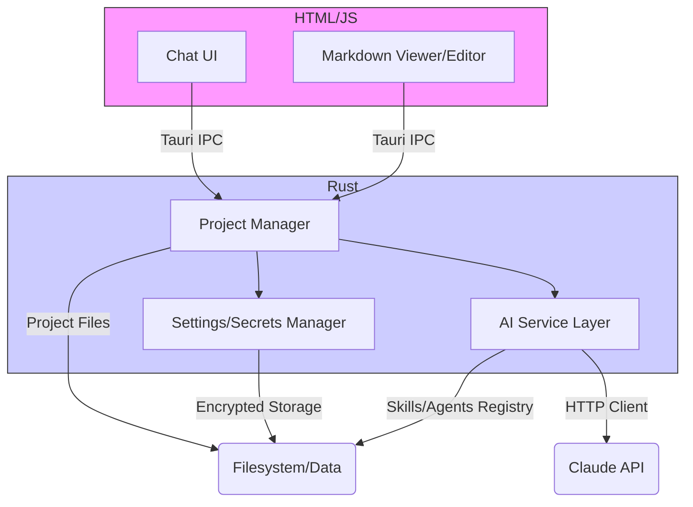

## 🚀 ai-researcher

### Research anything with AI agents, keep your projects in line, re-use and create AI agents to automate your work.

**ai-researcher** is a powerful desktop application designed to streamline research and automation tasks using AI agents. It provides a native, secure, and fast environment for managing AI-driven projects, leveraging the power of Rust and modern web technologies.

---

## ✨ Key Goals

The primary goals of the **ai-researcher** application are:

* **Intelligent Research:** Allow users to conduct complex research by orchestrating custom AI agents (skills).
* **Project Management:** Maintain project context, making it easy to re-use previous research artifacts and configurations.
* **Automation:** Provide a registry for reusable "skills" (AI agents) to automate repetitive or complex workflows.
* **Native Performance & Security:** Deliver a fast, cross-platform desktop experience with secure, native encryption for sensitive data.

---

## 🛠️ Technology Stack & Architecture

This application is built as a **cross-platform desktop application** using a robust modern stack.

### Core Technologies

| Component | Technology | Description |
| :--- | :--- | :--- |
| **Framework** | **Tauri** | Used for building the cross-platform desktop application, bridging the native Rust backend with the web frontend via IPC (Inter-Process Communication). |
| **Frontend** | **React** | Modern JavaScript library for building the user interface (Chat UI, Markdown Viewer/Editor). |
| **Backend** | **Rust** | Used for all native logic, performance-critical tasks, and system interactions. |

### Key Dependencies and Features

| Feature | Technology/API Used | Description |
| :--- | :--- | :--- |
| **AI Integration** | **HTTP Client for Claude API** | Dedicated client for securely making calls to the Claude API for agent interactions. |
| **File Operations** | **Native Rust Filesystem APIs** | High-performance, low-level file operations with asynchronous monitoring (file watcher) for project auto-discovery. |
| **Encryption** | **`ring` or `rust-crypto`** (AES-256-GCM) | Utilized for secure, native encryption of secrets and API keys, managed by the Settings/Secrets Manager. |
| **Data Storage** | **Pure Markdown Files** | All project data, conversation history, and settings are stored as human-readable Markdown files. **No external database is required.** |

### Framework and Stack

| Component | Technology | Description |
| :--- | :--- | :--- |
| **Framework** | **Tauri** | Used for building the cross-platform desktop application, bridging the native Rust backend with the web frontend. |
| **Frontend** | **React** | Modern JavaScript library for building the user interface (Chat UI, Markdown Viewer/Editor). |
| **Backend** | **Rust** | Used for all native logic, performance-critical tasks, and system interactions. |
| **Data Format** | **Pure Markdown Files** | All project data, conversation history, and settings are stored as human-readable Markdown files. **No database is required.** |
| **AI Integration** | **HTTP Client** | Dedicated client for securely making **Claude API calls**. |
| **File Operations** | **Native Rust Filesystem APIs** | High-performance, low-level file operations with asynchronous monitoring. |
| **Encryption** | **`ring` or `rust-crypto`** | Utilized for **AES-256-GCM encryption** of secrets and API keys, ensuring data security. |

### Architecture Layers

The application follows a clear separation of concerns, communicating via the Tauri IPC (Inter-Process Communication).



---

## 📂 Data Structure & Location

All application data is stored within the user's standard `AppDataDirectory` in a defined structure, promoting portability and easy backup:

| File/Directory | Description |
| :--- | :--- |
| **`.secrets.encrypted`** | **Encrypted global secrets** (e.g., AI API keys). Stored securely. |
| **`.settings.md`** | Global application configuration settings. |
| **`skills/`** | Directory for **reusable agent skills** (e.g., `skill-researcher.md`, `skill-coder.md`). |
| **`projects/`** | Main directory containing individual research projects. |
| **`projects/project-alpha/.project.md`** | Project metadata (goal, required skills, etc.). |
| **`projects/project-alpha/.settings.md`** | Project-specific configuration settings. |
| **`projects/project-alpha/chat-001.md`** | AI conversation artifacts/history. |
| **`projects/project-alpha/*.md`** | All research notes, analyses, and project outputs. |

---

## ⚙️ How to Run & Test

### Prerequisites

You will need the following installed:

1.  **Rust Toolchain:** Install Rust, typically via `rustup`.
2.  **Node.js & npm:** Required for the React frontend development.
3.  **Claude API Key:** An API key is necessary for the AI functionality.

### Running the Application (Development)

1.  **Clone the Repository:**
    ```bash
    git clone [https://github.com/your-username/ai-researcher.git](https://github.com/your-username/ai-researcher.git)
    cd ai-researcher
    ```
2.  **Install Frontend Dependencies:**
    ```bash
    npm install
    ```
3.  **Run the Tauri Development Build:**
    The Tauri command handles starting both the Rust backend and the React development server.
    ```bash
    npm run tauri dev
    ```

### Running Tests

* **Rust Backend Tests:** Run unit and integration tests for the native code:
    ```bash
    cargo test
    ```
* **React Frontend Tests:** Run tests for the UI components (assuming you use a tool like Jest or Vitest):
    ```bash
    npm run test
    ```

---

## 🤝 Contribution

We welcome contributions! Whether it's adding a new feature, fixing a bug, or improving documentation, your help is appreciated.

1.  **Fork** the repository.
2.  **Clone** your forked repository.
3.  **Create a new branch** (`git checkout -b feature/AmazingFeature`).
4.  **Make your changes.**
5.  **Commit your changes** (`git commit -m 'Add AmazingFeature'`).
6.  **Push** to the branch (`git push origin feature/AmazingFeature`).
7.  **Open a Pull Request** to the `main` branch of the original repository.

Please ensure your code follows the existing style, and all tests pass before submitting a PR.

---

## ⚖️ License

This project is licensed under the **Apache License 2.0**.

See the [`LICENSE`](./LICENSE) file for more details.
