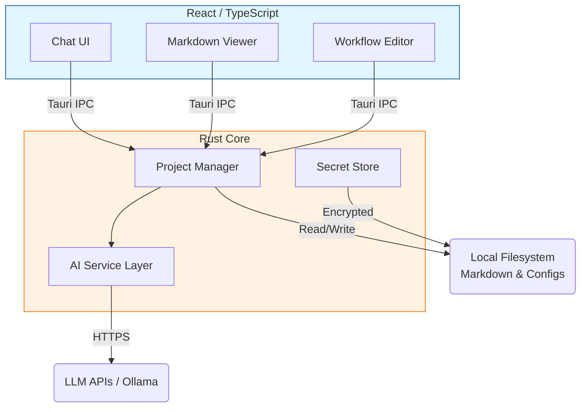

# 🚀 ai-researcher: Your Cross-Platform AI Agent Environment


### Research anything with AI agents, keep your projects in line, re-use and create AI agents to automate your work.

**ai-researcher** is a powerful desktop application designed to streamline research and automation tasks using AI agents. It provides a native, secure, and fast environment for managing AI-driven projects. Built with **Tauri** and **React**, it offers a seamless cross-platform experience while leveraging the raw performance of a **Rust** backend.

You can leverage local AI models, hosted AI services, and **MCP (Model Context Protocol)** tools to create autonomous agents that define your workflow.

---

## 📥 Downloads & Releases

Get the latest version of **ai-researcher** for macOS, Windows, and Linux.

[**Download Latest Release**](https://github.com/AIResearchFactory/ai-researcher/releases)

---

## ✨ Key Goals

The primary mission of **ai-researcher** is to give you ownership and power over your research data:

*   🤖 **Intelligent Research:** Orchestrate custom AI agents (skills) to conduct complex research tasks.
*   📂 **Project Management:** Keep your context, artifacts, and history in one place. All data is stored as **human-readable Markdown files**, making it easy to audit and reuse.
*   🔒 **Total Ownership:** No external databases. You own your data.
*   ⚡ **Native Performance:** Fast, secure, and encrypted local storage for sensitive keys.
*   🧩 **Automation:** A registry of reusable "skills" to automate repetitive workflows.

---

## 🌟 Main Capabilities

| Feature | Technology | Benefits |
| :--- | :--- | :--- |
| **Portability** | **Pure Markdown Files** | *No database required.* Your research is human-readable and move-ready. |
| **Cross-Platform** | **Tauri & React** | Native performance on Windows, macOS, and Linux. |
| **Control** | **Native FS APIs** | High-performance project auto-discovery and local file management. |
| **Extensibility** | **MCP Support** | Connect custom servers to expand agent capabilities. |
| **Workflows** | **Canvas UI** | Drag-and-drop experience for orchestrating complex agent workflows. |

### 🔌 Enhanced Workflows with MCP
**ai-researcher** now includes **MCP (Model Context Protocol)** support. Connect any MCP server to give your agents real-time access to external data, tools, and integrations.

Check out the [MCP Marketplace](src/data/mcp_marketplace.ts) for supported integrations.

---

## 🛠️ Technical Architecture

This application is built as a **cross-platform desktop application** using a modern, robust stack designed for performance and security.

### Architecture Diagram

The application uses **Tauri IPC** to bridge the React frontend and Rust backend.



### Technology Stack

| Component | Technology | Description |
| :--- | :--- | :--- |
| **Framework** | **Tauri (v2)** | Bridges Rust backend with Web frontend. Ultra-lightweight and secure. |
| **Frontend** | **React + Tailwind** | Modern UI library with beautiful, responsive styling. |
| **Backend** | **Rust** | Handles system operations, file I/O, encryption, and AI logic. |
| **Data Format** | **Markdown (.md)** | All data is flat-file based. Portable, git-friendly, and human-readable. |
| **Encryption** | **AES-256-GCM** | Native encryption for API keys using `ring` or `rust-crypto`. |
| **AI Client** | **reqwest** | robust HTTP client for Claude, OpenAI, and Ollama interactions. |

---

## 📂 Data Structure

All application data is stored within your system's standard `AppDataDirectory`.

| File/Directory | Purpose |
| :--- | :--- |
| **`.secrets.encrypted`** | **Encrypted global secrets** (e.g., AI API keys). Stored securely. |
| **`.settings.md`** | Global application configuration settings. |
| **`skills/`** | Directory for **reusable agent skills** (e.g., `skill-researcher.md`, `skill-coder.md`). |
| **`projects/`** | Main directory containing individual research projects. |
| **`projects/project-alpha/.project.md`** | Project metadata (goal, required skills, etc.). |
| **`projects/project-alpha/.settings.md`** | Project-specific configuration settings. |
| **`projects/project-alpha/chat-001.md`** | AI conversation artifacts/history. |
| **`projects/project-alpha/*.md`** | All research notes, analyses, and project outputs. |
---

## ⚙️ Development & Testing

### Prerequisites
1.  **Rust:** Required for the Rust backend.
```bash
`curl --proto '=https' --tlsv1.2 -sSf https://sh.rustup.rs | sh`
```
2.  **Node.js (v18+):** Required for the React frontend development. 
```bash
& `npm` / `pnpm`
```
3.  **Claude API Key:** (Optional, for hosted Claude AI features)

### Running Locally

1.  **Clone the repo:**
    ```bash
    git clone https://github.com/AIResearchFactory/ai-researcher.git
    cd ai-researcher
    ```

2.  **Install dependencies:**
    ```bash
    npm install
    ```

3.  **Run in Dev Mode:**
    ```bash
    npm run tauri dev
    ```

### Testing
-  **Rust Backend Tests:** Run unit and integration tests for the native code:
    ```bash
    cargo test
    ```
- **React Frontend Tests:** Run tests for the UI components (assuming you use a tool like Jest or Vitest):
    ```bash
    npm run test
    ```

---

## 🤝 Contributing

We welcome contributions! Whether it's adding a new feature, fixing a bug, or improving documentation, your help is appreciated.

1.  Fork & Clone.
2.  Create branch: `git checkout -b feature/cool-feature`
3.  **Make your changes.**
4.  Commit & Push.
5.  Open a Pull Request.

---

## ⚖️ License

This project is licensed under the **Apache License 2.0**. See [`LICENSE`](./LICENSE) for details.
