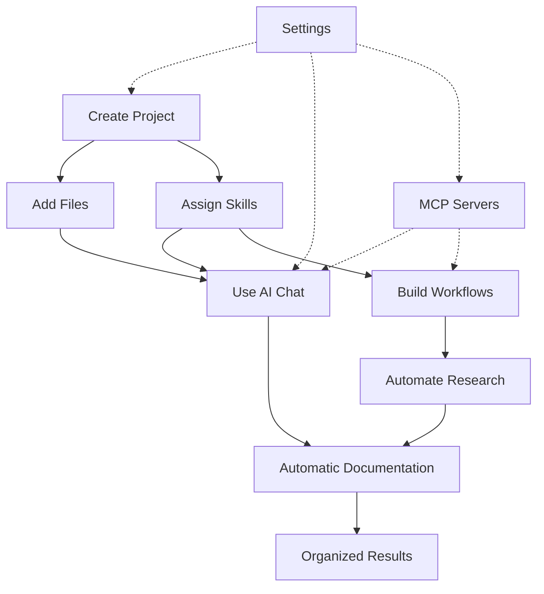

# Main Components

[← Previous: Why AI Researcher?](01-why-ai-researcher.md) | [Back to Documentation Home](README.md) | [Next: Installation Guide →](03-installation.md)

---

## Overview

AI Researcher is built around a few core components that work together to create a powerful research workspace. This guide explains each component from a user's perspective.

## Table of Contents
- [Projects](#projects)
- [Files](#files)
- [AI Chat](#ai-chat)
- [Skills](#skills)
- [Workflows](#workflows)
- [MCP Integration](#mcp-integration)
- [Settings](#settings)

---

## Projects

**What it is**: A project is an organized workspace for a specific research topic or goal.

**Think of it as**: A folder that contains all your research, notes, AI conversations, and outputs for one topic.

**Example projects**:
- "Q1 2026 Competitive Analysis"
- "New Feature Research - Dark Mode"
- "Customer Interview Analysis"
- "Market Research - AI Tools"

**What's inside a project**:
- Markdown files with your research notes
- AI chat history automatically saved
- Workflows specific to this project
- Project-specific settings

**Why use projects**:
- Keep different research topics separate
- Find everything related to one topic in one place
- Share entire projects with teammates
- Track progress on specific goals

[Learn more in the Projects Guide →](04-projects-guide.md)

---

## Files

**What it is**: Markdown documents within your projects where you write, organize, and store your research.

**Think of it as**: Like Google Docs or Notion pages, but stored locally as simple text files.

**File types you'll work with**:
- **Research notes** - Your findings and analysis
- **Chat transcripts** - Automatically saved AI conversations
- **Reports** - Final outputs like PRDs or summaries
- **Meeting notes** - Documentation from discussions

**Why Markdown**:
- Human-readable plain text
- Works with any text editor
- Easy to version control with Git
- No vendor lock-in
- Fast to search and process

**Key features**:
- Built-in Markdown editor with preview
- Automatic saving
- File organization within projects
- Easy to export and share

---

## AI Chat

**What it is**: A built-in AI assistant that helps you research, analyze, and create content.

**Think of it as**: Like ChatGPT or Claude, but integrated directly into your workspace with automatic documentation.

**How it works**:
1. Open a project
2. Start chatting with the AI
3. Your conversation is automatically saved to your project
4. Reference previous conversations anytime

**Key features**:
- **Multiple AI providers**: Use Ollama (local), Claude, OpenAI, Gemini, or others
- **Context-aware**: AI knows about your project and files
- **Automatic documentation**: Every conversation saved as Markdown
- **File attachments**: Include project files in your chat context
- **Skill integration**: Use specialized AI agents for specific tasks

**What makes it different from regular AI chat**:
- No manual copy-pasting needed
- All conversations organized by project
- Full history always available
- Works with your local files
- Can use custom skills for specialized tasks

[Learn more in the Projects Guide →](04-projects-guide.md)

---

## Skills

**What it is**: Reusable AI agent templates that perform specific tasks consistently.

**Think of it as**: Pre-programmed AI assistants that are experts in particular areas.

**Example skills**:
- **Research Assistant** - Conducts thorough research on topics
- **Competitive Analyst** - Analyzes competitor features and positioning
- **PRD Generator** - Creates Product Requirements Documents
- **Document Summarizer** - Extracts key points from long documents
- **Code Reviewer** - Analyzes code for best practices

**How skills work**:
1. Define the skill's role and tasks
2. Specify the output format you want
3. Assign skills to projects
4. Use them in chat or workflows

**Why use skills**:
- **Consistency**: Get the same quality output every time
- **Efficiency**: Don't repeat instructions for common tasks
- **Specialization**: Create experts for different domains
- **Reusability**: Use the same skill across multiple projects
- **Sharing**: Share skills with your team

**Skill components**:
- **Role**: What the AI agent is (e.g., "Senior Product Manager")
- **Tasks**: What it does (e.g., "Research competitors and create comparison tables")
- **Output format**: How results should be structured
- **Examples**: Sample inputs and expected outputs

[Learn more in the Skills Guide →](05-skills-guide.md)

---

## Workflows

**What it is**: Automated multi-step processes that use AI to complete complex tasks.

**Think of it as**: A recipe that tells AI how to break down a big task into steps and execute them automatically.

**Example workflows**:
- **Competitive Research**: Takes a list of competitors → researches each → creates comparison table
- **Document Analysis**: Takes multiple files → summarizes each → creates synthesis report
- **Feature Validation**: Reads PRD → checks Jira tickets → identifies gaps → suggests updates

**How workflows work**:
1. Design your workflow visually with connected steps
2. Each step uses a skill or performs an action
3. Steps can run sequentially or in parallel
4. Results flow from one step to the next
5. Final output saved to your project

**Workflow step types**:
- **Input**: Provide data (text, files, URLs)
- **Agent**: Use a skill to process information
- **Iteration**: Process a list of items (in parallel!)
- **Synthesis**: Combine results from multiple steps
- **Conditional**: Branch based on conditions

**Why use workflows**:
- **Automation**: Run complex processes with one click
- **Parallel processing**: Handle multiple items simultaneously
- **Repeatability**: Run the same workflow again and again
- **Time savings**: Hours of work done in minutes
- **Consistency**: Same process every time

**Real-world impact**:
- Competitive research: 6-8 hours → 30-45 minutes
- Document processing: 3-4 hours → 20-30 minutes
- Cross-tool validation: 2-3 hours → 15-20 minutes

[Learn more in the Workflows Guide →](06-workflows-guide.md)

---

## MCP Integration

**What it is**: Model Context Protocol (MCP) allows AI to connect to external tools and data sources.

**Think of it as**: Giving your AI assistant the ability to read and write to your other work tools.

**What MCP enables**:
- Read from GitHub repositories
- Search the web with Brave Search
- Access local files and directories
- Query databases
- Interact with Jira, Notion, and other tools
- And much more...

**Example use cases**:
- **Cross-tool validation**: Check if Jira tickets match your PRD in Aha
- **Automated updates**: Update multiple tools based on research findings
- **Data gathering**: Pull information from various sources automatically
- **Integration workflows**: Connect different parts of your tech stack

**Popular MCP servers**:
- **GitHub** - Access repositories, issues, and PRs
- **Brave Search** - Web search capabilities
- **Filesystem** - Secure local file access
- **Ollama** - Local AI model integration
- **Git** - Repository analysis and manipulation
- **PostgreSQL** - Database querying

**How to use MCP**:
1. Configure MCP servers in Settings
2. Enable the servers you need
3. AI can now access those tools in chat and workflows
4. No manual data transfer needed

**Important**: MCP is optional. AI Researcher works great without it, but MCP unlocks powerful cross-tool automation.

[Learn more in the Settings Guide →](07-settings-guide.md)

---

## Settings

**What it is**: Configuration options for customizing AI Researcher to your needs.

**Two types of settings**:

### Global Settings
Apply to the entire application:
- **Theme**: Light, dark, or system
- **AI Provider**: Choose Ollama, Claude, OpenAI, Gemini, etc.
- **API Keys**: Securely store credentials
- **MCP Servers**: Configure external tool connections
- **Data Directory**: Where your projects are stored

### Project Settings
Apply to individual projects:
- **Project name and goal**
- **Assigned skills**
- **Auto-save preferences**
- **Encryption options**

**Security features**:
- API keys encrypted with AES-256-GCM
- Password required to unlock secrets
- Local storage only
- No data sent to external servers (except AI API calls)

[Learn more in the Settings Guide →](07-settings-guide.md)

---

## How Components Work Together

Here's how everything connects in a typical workflow:

**Example flow**:
1. **Create a project** for your research topic
2. **Configure settings** to use your preferred AI provider
3. **Create or assign skills** for specialized tasks
4. **Use AI chat** to research and document findings
5. **Build workflows** to automate repetitive processes
6. **Connect MCP servers** for external tool integration
7. **Everything is automatically saved** as Markdown files

---

## What's Next?

Now that you understand the main components, you're ready to:

1. **[Install AI Researcher](03-installation.md)** - Get set up in 10 minutes
2. **[Create your first project](04-projects-guide.md)** - Start researching
3. **[Explore skills](05-skills-guide.md)** - Create specialized AI agents
4. **[Build workflows](06-workflows-guide.md)** - Automate your work

---

[← Previous: Why AI Researcher?](01-why-ai-researcher.md) | [Back to Documentation Home](README.md) | [Next: Installation Guide →](03-installation.md)