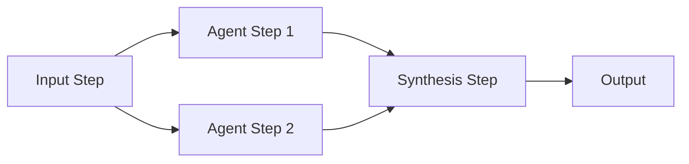

# Workflows Guide

[← Previous: Skills Guide](05-skills-guide.md) | [Back to Documentation Home](README.md) | [Next: Settings Guide →](07-settings-guide.md)

---

## Table of Contents
- [What are Workflows?](#what-are-workflows)
- [Why Use Workflows?](#why-use-workflows)
- [Workflow Concepts](#workflow-concepts)
- [Creating a Workflow](#creating-a-workflow)
- [Step Types Explained](#step-types-explained)
- [Running Workflows](#running-workflows)
- [Real-World Example](#real-world-example)
- [Best Practices](#best-practices)
- [Managing Workflows](#managing-workflows)

---

## What are Workflows?

**Workflows** are automated multi-step processes that use AI to complete complex tasks. Think of them as recipes that tell AI how to break down a big task into steps and execute them automatically.

### The Problem Workflows Solve

**Without workflows**, repetitive tasks are painful:
- Research 5 competitors → Do it manually, one by one (6-8 hours)
- Analyze 10 customer interviews → Process each individually (4-5 hours)
- Validate PRD against Jira tickets → Check manually, item by item (2-3 hours)

**With workflows**, you automate the process:
- Define the steps once
- Run with one click
- Process items in parallel
- Get results in minutes instead of hours

### Real-World Analogy

Think of workflows like assembly lines:
- **Without workflow**: One person does everything, one item at a time
- **With workflow**: Specialized stations (skills) work in parallel, processing multiple items simultaneously

---

## Why Use Workflows?

### 1. Automation
Run complex processes with one click.

**Example**: Competitive research workflow
- Input: List of 5 competitors
- Process: Research each automatically
- Output: Individual reports + comparison table
- Time: 30 minutes instead of 6-8 hours

### 2. Parallel Processing
Handle multiple items simultaneously, not sequentially.

**Without workflows**:
- Research competitor 1 (1 hour)
- Research competitor 2 (1 hour)
- Research competitor 3 (1 hour)
- Total: 3+ hours

**With workflows**:
- Research all 3 competitors at the same time
- Total: 30-45 minutes

### 3. Repeatability
Run the same workflow again and again.

**Use cases**:
- Quarterly competitive analysis
- Monthly customer feedback synthesis
- Weekly market research updates
- Regular compliance checks

### 4. Consistency
Same process, same quality, every time.

**Benefits**:
- No steps forgotten
- Consistent output format
- Reliable results
- Easy to audit

### 5. Time Savings

Real-world impact:
- **Competitive research**: 6-8 hours → 30-45 minutes (5-7 hours saved)
- **Document analysis**: 3-4 hours → 20-30 minutes (2-3 hours saved)
- **Cross-tool validation**: 2-3 hours → 15-20 minutes (2+ hours saved)

---

## Workflow Concepts

### Steps

A workflow is made up of **steps**. Each step performs a specific action:
- Get input data
- Process information with AI
- Iterate over a list
- Combine results
- Make decisions

### Dependencies

Steps can depend on other steps:
- **Sequential**: Step B runs after Step A completes
- **Parallel**: Steps B and C run at the same time after Step A
- **Conditional**: Step B or C runs based on a condition

### Execution Flow



In this example:
1. Input step provides data
2. Two agent steps run in parallel
3. Synthesis step combines results
4. Final output is generated

---

## Creating a Workflow

Let's create a competitive research workflow. You can do this automatically with AI or manually with the visual builder.

### Method 1: AI Generation (Fastest)

Simply ask the AI in the chat:
> "Create a workflow to research 5 competitors and summarize them"

The AI will:
1. Design the workflow steps
2. Choose the right skills
3. Suggest the workflow for you to save

### Method 2: Visual Builder

Let's create a competitive research workflow step by step manually.

### Step 1: Open the Workflows Tab

1. Click the **"Flows"** tab in the left sidebar
2. Click **"+ New Workflow"**
3. The workflow canvas opens

### Step 2: Name Your Workflow

1. Click the workflow name at the top
2. Enter: "Competitive Research Workflow"
3. Add description: "Researches multiple competitors in parallel and creates a comparison table"

### Step 3: Add an Input Step

**Purpose**: Provide the list of competitors to research.

1. Click **"+ Add Step"** or drag from the toolbar
2. Select **"Input"** step type
3. Configure:
   - **Name**: "Competitor List"
   - **Source Type**: "Text Input"
   - **Source Value**: Enter your list:
     ```
     - Notion
     - Coda
     - Airtable
     - Monday.com
     - ClickUp
     ```
4. Click **"Save"**

### Step 4: Add an Iteration Step

**Purpose**: Process each competitor from the list.

1. Add a new step
2. Select **"Iteration"** step type
3. Configure:
   - **Name**: "Research Each Competitor"
   - **Items Source**: Select "Competitor List" (the input step)
   - **Parallel**: Enable (✓) - This processes all competitors at the same time!
   - **Output Pattern**: `competitor-{item}.md`
4. Connect it to the Input step (drag from Input to Iteration)

### Step 5: Add an Agent Step (Inside Iteration)

**Purpose**: Use a skill to research each competitor.

1. Inside the Iteration step, add an **"Agent"** step
2. Configure:
   - **Name**: "Analyze Competitor"
   - **Skill**: Select "Competitive Analyst"
   - **Input**: `{item}` (the current competitor from the list)
3. This step runs for each competitor in parallel

### Step 6: Add a Synthesis Step

**Purpose**: Combine all competitor analyses into a comparison table.

1. Add a new step after the Iteration
2. Select **"Synthesis"** step type
3. Configure:
   - **Name**: "Create Comparison Table"
   - **Skill**: Select "Document Summarizer" or create a custom synthesis skill
   - **Input Files**: All outputs from the Iteration step
   - **Output File**: `competitive-comparison.md`
4. Connect the Iteration step to this Synthesis step

### Step 7: Save the Workflow

1. Click **"Save Workflow"**
2. The workflow is now ready to run

### Visual Representation

Your workflow should look like this:

```
[Competitor List Input]
         ↓
[Research Each Competitor] (Iteration - Parallel)
    ↓    ↓    ↓    ↓    ↓
  [Analyze] [Analyze] [Analyze] [Analyze] [Analyze]
    ↓    ↓    ↓    ↓    ↓
         ↓
[Create Comparison Table] (Synthesis)
         ↓
    [Output Files]
```

---

## Step Types Explained

### 1. Input Step

**Purpose**: Provide data to the workflow.

**Source Types**:
- **Text Input**: Type or paste text directly
- **File Upload**: Upload a file from your computer
- **Project File**: Select an existing file from the project
- **External URL**: Fetch data from a URL

**Example uses**:
- List of items to process
- Document to analyze
- Data to transform
- URLs to scrape

**Configuration**:
```
Name: "Customer Feedback List"
Source Type: "Project File"
Source Value: "customer-interviews.md"
Output File: "feedback-input.md"
```

### 2. Agent Step

**Purpose**: Use a skill to process information.

**How it works**:
1. Takes input (text, file, or previous step output)
2. Applies the selected skill
3. Produces output

**Example uses**:
- Research a topic
- Analyze a document
- Generate a report
- Review code
- Summarize content

**Configuration**:
```
Name: "Research Competitor"
Skill: "Competitive Analyst"
Input Files: ["competitor-name.txt"]
Parameters: { "depth": "comprehensive" }
```

### 3. Iteration Step

**Purpose**: Process a list of items, optionally in parallel.

**How it works**:
1. Takes a list of items
2. Runs child steps for each item
3. Can process all items simultaneously (parallel) or one by one (sequential)

**Example uses**:
- Research multiple competitors
- Analyze multiple documents
- Process customer feedback
- Validate multiple requirements

**Configuration**:
```
Name: "Process All Competitors"
Items Source: "Competitor List Input"
Parallel: true (✓)
Output Pattern: "competitor-{item}-analysis.md"
```

**Key feature**: **Parallel processing** is what makes workflows so powerful. Instead of processing 5 competitors in 5 hours, process them all in 1 hour!

### 4. Synthesis Step

**Purpose**: Combine results from multiple steps into a unified output.

**How it works**:
1. Takes outputs from previous steps
2. Analyzes and combines them
3. Creates a summary or comparison

**Example uses**:
- Create comparison tables
- Synthesize research findings
- Generate executive summaries
- Combine multiple analyses

**Configuration**:
```
Name: "Create Comparison Table"
Skill: "Document Summarizer"
Input Files: [all iteration outputs]
Output File: "competitive-comparison.md"
```

### 5. Conditional Step

**Purpose**: Branch the workflow based on conditions.

**How it works**:
1. Evaluates a condition
2. Runs "then" step if true
3. Runs "else" step if false

**Example uses**:
- Check if requirements are met
- Validate data quality
- Route based on content
- Handle different scenarios

**Configuration**:
```
Name: "Check Completeness"
Condition: "document contains all required sections"
Then Step: "Generate Final Report"
Else Step: "Request More Information"
```

---

## Running Workflows

### Method 1: From the Flows Tab

### Step 1: Select the Workflow

1. Go to the **"Flows"** tab
2. Click on the workflow you want to run
3. The workflow canvas opens

### Step 2: Review Configuration

1. Check that all steps are configured correctly
2. Verify input data is ready
3. Ensure required skills are available

### Step 3: Run the Workflow

1. Click the **"▶ Run Workflow"** button
2. Confirm you want to start
3. The workflow begins executing

### Method 2: From Chat

You can run workflows directly from the chat interface:
1. Type `#` to see a list of your workflows
2. Select the workflow (e.g., `#CompetitiveResearch`)
3. Press Enter to reference it
4. The AI can helps you run it or answer questions about it

### Step 4: Monitor Progress

Watch the workflow execute:
- Steps light up as they run
- Progress indicators show completion
- Parallel steps run simultaneously
- You can see which step is currently active

**Status indicators**:
- ⏳ **Pending**: Waiting to run
- ▶️ **Running**: Currently executing
- ✅ **Complete**: Successfully finished
- ❌ **Error**: Failed (check error message)

### Step 5: Review Results

When the workflow completes:
1. Check the project folder for output files
2. Review each generated document
3. Verify the synthesis/comparison file
4. All files are automatically saved to your project

### Handling Errors

If a step fails:
1. Check the error message
2. Review the step configuration
3. Verify input data is correct
4. Fix the issue and re-run

**Common issues**:
- Missing input data
- Skill not found
- API rate limits
- Invalid configuration

---

## Real-World Example

Let's walk through the competitive research use case in detail.

### Scenario

You're a product manager who needs to research 5 competitors every quarter. Manually, this takes 6-8 hours. With a workflow, it takes 30-45 minutes.

[See the complete use case →](use-cases/Use-Case2-Using_Workflows.md)

### The Manual Way (Without Workflows)

**Time: 6-8 hours**

For each of 5 competitors:
1. Open AI chat (10 min)
2. Research the competitor (45 min)
3. Copy responses to document (15 min)
4. Format and organize (20 min)
5. Repeat for next competitor

Then:
6. Manually create comparison table (1 hour)
7. Review and refine (30 min)

**Total**: 6-8 hours of tedious, repetitive work

### The Workflow Way

**Time: 30-45 minutes**

**One-time setup** (15 minutes):
1. Create "Competitive Analyst" skill
2. Build workflow with steps:
   - Input: List of competitors
   - Iteration: Process each (parallel)
   - Agent: Use Competitive Analyst skill
   - Synthesis: Create comparison table

**Every quarter** (30 minutes):
1. Update competitor list (5 min)
2. Click "Run Workflow" (1 min)
3. Wait for completion (15-20 min)
4. Review and refine results (10 min)

**Time saved**: 5-7 hours per quarter = 20-28 hours per year!

### Workflow Design

```
[Input: Competitor List]
    Notion
    Coda
    Airtable
    Monday.com
    ClickUp
         ↓
[Iteration: Research Each] (Parallel ✓)
    ↓    ↓    ↓    ↓    ↓
  [Agent: Competitive Analyst Skill]
    ↓    ↓    ↓    ↓    ↓
  notion.md  coda.md  airtable.md  monday.md  clickup.md
         ↓
[Synthesis: Create Comparison]
         ↓
  competitive-comparison.md
```

### What You Get

**Individual files** (one per competitor):
- `competitor-notion.md` - Full analysis of Notion
- `competitor-coda.md` - Full analysis of Coda
- `competitor-airtable.md` - Full analysis of Airtable
- `competitor-monday.md` - Full analysis of Monday.com
- `competitor-clickup.md` - Full analysis of ClickUp

**Comparison file**:
- `competitive-comparison.md` - Table comparing all 5 competitors

**All automatically generated and saved to your project!**

---

## Best Practices

### Workflow Design

**Start simple**:
- Begin with 2-3 steps
- Test and verify it works
- Add complexity gradually
- Don't over-engineer

**Use parallel processing**:
- Enable parallel in Iteration steps
- Massive time savings
- Process 10 items as fast as 1 item

**Break down complex tasks**:
- One step = one clear purpose
- Multiple simple steps > one complex step
- Easier to debug and maintain

**Name steps clearly**:
- ❌ "Step 1", "Step 2"
- ✅ "Research Competitors", "Create Comparison"

### Skill Selection

**Match skills to steps**:
- Use specialized skills for specific tasks
- Research Assistant for research steps
- Competitive Analyst for competitor analysis
- Document Summarizer for synthesis

**Create workflow-specific skills**:
- If you run a workflow often, create a dedicated skill
- Optimize the skill for that workflow
- Better results, more consistency

### Input Data

**Structure your input**:
- Use clear, consistent formats
- Lists should be well-formatted
- Include all necessary information
- Test with sample data first

**Example good input**:
```
Competitors to research:
- Notion (notion.so)
- Coda (coda.io)
- Airtable (airtable.com)
```

**Example poor input**:
```
notion, coda, airtable
```

### Testing

**Test before running at scale**:
1. Test with 1-2 items first
2. Verify output quality
3. Adjust configuration
4. Then run with full dataset

**Iterate and improve**:
- Run the workflow
- Review results
- Identify improvements
- Update and re-run

### When to Use Workflows

**Good use cases**:
- ✅ Repetitive tasks (quarterly reports)
- ✅ Processing lists (multiple competitors, documents)
- ✅ Multi-step processes (research → analyze → synthesize)
- ✅ Time-consuming manual work

**Not ideal for**:
- ❌ One-off tasks (just use chat)
- ❌ Simple single-step tasks (use a skill directly)
- ❌ Highly creative work (needs human judgment)
- ❌ Tasks requiring real-time interaction

---

## Managing Workflows

### Editing Workflows

1. Select the workflow in the Flows tab
2. Click **"Edit"**
3. Make your changes:
   - Add/remove steps
   - Modify configurations
   - Change connections
4. Click **"Save"**

**Note**: Changes take effect immediately for future runs.

### Duplicating Workflows

To create a variation:
1. Select the workflow
2. Click **"Duplicate"**
3. Rename the copy
4. Modify as needed

**Use case**: Create quarterly variations (Q1, Q2, Q3, Q4) with different competitor lists.

### Deleting Workflows

1. Select the workflow
2. Click **"Delete"**
3. Confirm deletion

**Warning**: This cannot be undone. Consider duplicating before deleting if you might need it later.

### Organizing Workflows

**Naming conventions**:
- Include purpose: "Competitive Research Workflow"
- Include frequency: "Monthly Customer Feedback Analysis"
- Include scope: "Q1 2026 Market Research"

**Workflow library**:
- Keep active workflows in the main list
- Archive old workflows (duplicate to archive project)
- Document what each workflow does
- Share successful workflows with team

### Sharing Workflows

Workflows are stored in your project's `.workflows/` folder as JSON files. To share:

1. Navigate to your project folder
2. Copy the `.workflows/` folder
3. Share with teammates
4. They copy it to their project

[Learn more about sharing →](08-data-portability.md)

---

## Advanced Workflow Patterns

### Pattern 1: Research → Analyze → Report

```
[Input: Topic]
    ↓
[Agent: Research]
    ↓
[Agent: Analyze]
    ↓
[Agent: Generate Report]
    ↓
[Output: Final Report]
```

**Use case**: Deep dive research on a single topic.

### Pattern 2: Parallel Processing → Synthesis

```
[Input: List]
    ↓
[Iteration: Process Each] (Parallel)
    ↓    ↓    ↓
[Synthesis: Combine]
    ↓
[Output: Summary]
```

**Use case**: Competitive research, document analysis, customer feedback.

### Pattern 3: Conditional Branching

```
[Input: Data]
    ↓
[Conditional: Check Quality]
    ↓           ↓
[Then: Process] [Else: Request More]
    ↓
[Output]
```

**Use case**: Data validation, quality checks, routing.

### Pattern 4: Multi-Stage Pipeline

```
[Input]
    ↓
[Stage 1: Gather]
    ↓
[Stage 2: Process] (Parallel)
    ↓
[Stage 3: Analyze]
    ↓
[Stage 4: Synthesize]
    ↓
[Output]
```

**Use case**: Complex research projects, comprehensive analysis.

---

## What's Next?

Now that you understand workflows, explore:

1. **[Settings Guide](07-settings-guide.md)** - Configure AI providers and MCP servers for workflows
2. **[Data Portability Guide](08-data-portability.md)** - Share workflows with your team
3. **[Use Case 2](use-cases/Use-Case2-Using_Workflows.md)** - See a complete workflow example

---

[← Previous: Skills Guide](05-skills-guide.md) | [Back to Documentation Home](README.md) | [Next: Settings Guide →](07-settings-guide.md)